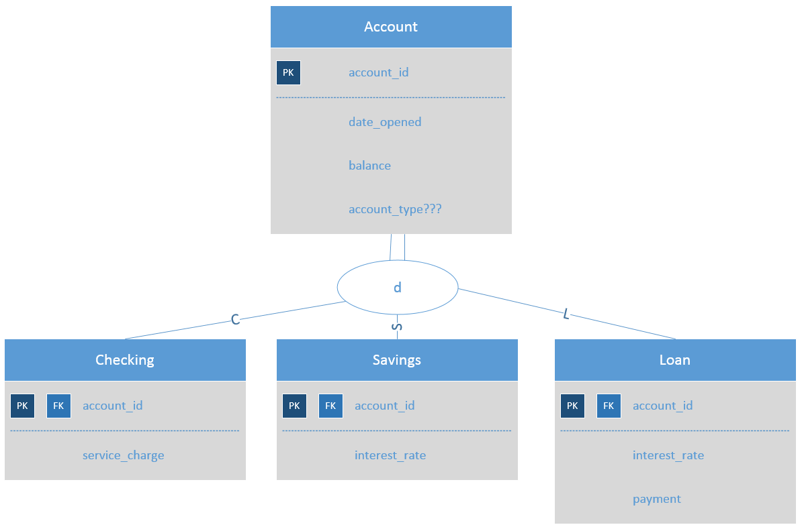

# Super-Subtype Entity Relationship

Make sure you have created your tables
using [this data definition language][2].



To get all the loan accounts, and their details, you will need
a [`JOIN` statement][1].

```sql
SELECT *
FROM eerd_account
JOIN eerd_loan
  ON eerd_account.account_id = eerd_loan.account_id
```

Or you could just filter on the `account_type` if you're not interested in the details.
This query is much more efficient, and will run faster if the additional information
is not necessary for your business question.

```sql
SELECT *
FROM eerd_account
WHERE account_type = 'L'
```

[1]:http://www.w3schools.com/sql/sql_join.asp
[2]:./ddl.sql
